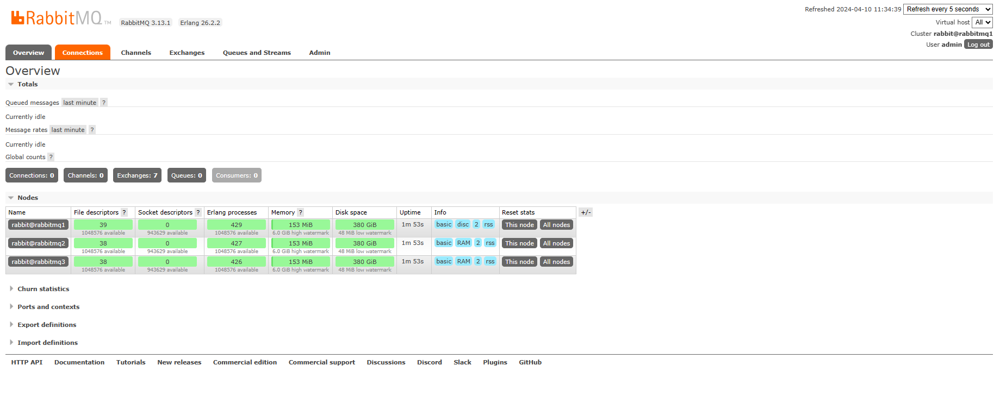

English | [简体中文](./readme_cn.md)

## Introduction
Deploy a RabbitMQ cluster with one click using docker-compose, including 3 nodes.

## Usage
1. Install docker and docker-compose
2. Download this project

```shell
git clone https://github.com/hsu1943/rabbitmq-cluster-docker-compose.git
```

3. Configure the environment variables in stack.env
Copy a copy of stack.env.example, named stack.env


```shell
cp stack.env.example stack.env
```

Specific configuration:

```env
# RabbitMQ management username and password
RABBITMQ_DEFAULT_USER=admin
RABBITMQ_DEFAULT_PASS=admin

# Shared cookie for RabbitMQ cluster
RABBITMQ_ERLANG_COOKIE=rabbit-cookie

# This directory path
RABBITMQ_PATH=.
```

4. Grant execute permission to the script

```shell
chmod +x ./join-cluster.sh
```

5. Start

```shell
docker-compose --env-file ./stack.env up -d
```

Log in to RabbitMQ management: http://localhost:15672, you can see the cluster status of 3 nodes:


## Reference
- [serkodev/rabbitmq-cluster-docker](https://github.com/serkodev/rabbitmq-cluster-docker)
- [RabbitMQ Clustering Guide](https://www.rabbitmq.com/clustering.html)
- [hub.docker.com/_/rabbitmq](https://hub.docker.com/_/rabbitmq)

## License
[MIT](./LICENSE)